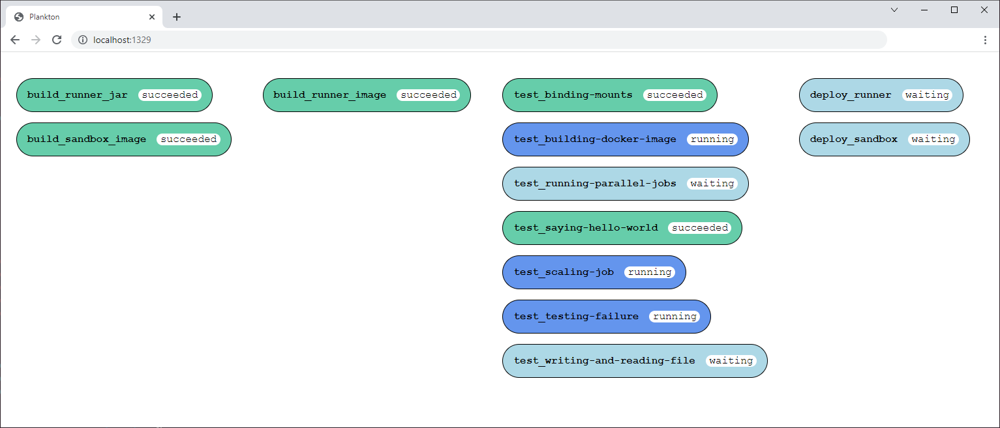

# Plankton


Plankton is an open-source CI/CD tool that leverages the power of containers to run each pipeline job within its own isolated environment.

With Plankton, you can define a pipeline configuration using a `plankton.yaml` file and execute it using a `docker run` command. Once the pipeline is running, you can track its progress using either the terminal or a web interface in your browser.

## Example

Here's an example of a `plankton.yaml` file:

```yaml
jobs:

  test:
    image: alpine
    volumes:
      - ./:/usr/src/app
    working_dir: /usr/src/app
    entrypoint:
      - for i in $(seq 1 5); do
      - echo "Testing..."
      - sleep 1
      - done

  build:
    depends_on: test
    image: alpine
    volumes:
      - ./:/usr/src/app
    working_dir: /usr/src/app
    entrypoint:
      - for i in $(seq 1 7); do
      - echo "Building..."
      - sleep 1
      - done

  deploy:
    depends_on: build
    image: alpine
    volumes:
      - ./:/usr/src/app
    working_dir: /usr/src/app
    entrypoint:
      - for i in $(seq 1 3); do
      - echo "Deploying..."
      - sleep 1
      - done
```

To run the pipeline, execute the following command:

```shell
docker run -it -v /var/run/docker.sock:/var/run/docker.sock -v $PWD:/usr/src/app -w /usr/src/app -p 1329:1329 adarlan/plankton
```

You can track the progress of your pipeline in your browser by visiting [http://localhost:1329](http://localhost:1329):


You can also follow the logs in your terminal:


## Plankton is based on the Compose Specification

You may have noticed that the `plankton.yaml` file
is configured similarly to a Docker Compose file,
but instead of defining `services`, in the Plankton file you define `jobs`.

This configuration format is defined by the
[Compose Specification](https://github.com/compose-spec/compose-spec/blob/master/spec.md),
which establishes a standard for the definition of multi-container systems.

By using the Compose Specification, Plankton can benefit from a well-defined specification that is known to many people and maintained by a global community.

## Plankton uses itself

In the Plankton repository there is a `plankton.yaml` file,
where is configured a pipeline to build, test and deploy the Plankton itself.

See how it looks in the web interface:



## Learn more

Check out the following resources to find out more about Plankton:

- [Plankton CLI reference](docs/runner-configuration.md)
- [Plankton pipeline configurarion reference](docs/pipeline-configuration.md)
- [Using Plankton to build and test a web application](examples/testing-web-application/)
- [Try Plankton in Play-with-Docker](docs/running-in-pwd.md)
- [Running parallel jobs with Plankton](examples/running-parallel-jobs/)
- [Using Plankton to test, build and deploy itself](docs/building-itself.md)
- [Running Plankton jobs in a sandbox](docs/sandbox.md)
