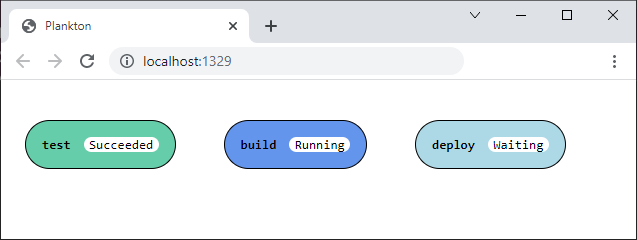
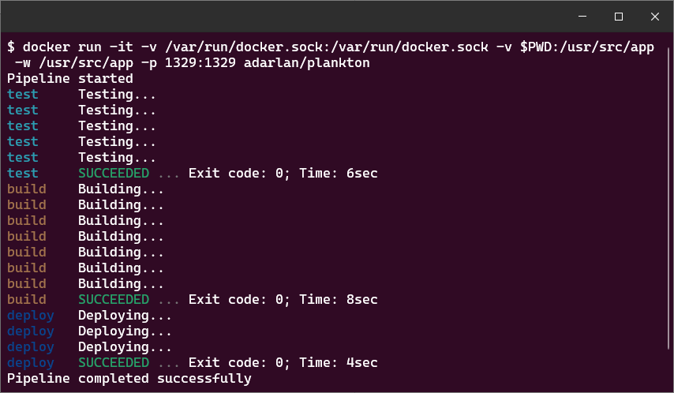

# Plankton


Plankton is an open-source CI/CD tool based on the Compose Specification.

Just create a `plankton.yaml` file containing the pipeline configuration,
and execute a `docker run` command to start it.
Once the pipeline is running,
you can track its progress on the terminal or the web interface in your browser.

## Example

Create a `plankton.yaml` file:

```yaml
services:

  test:
    image: alpine
    volumes:
      - ./:/usr/src/app
    working_dir: /usr/src/app
    entrypoint:
      - for i in $(seq 1 5); do echo "Testing..."; sleep 1; done

  build:
    depends_on: test
    image: alpine
    volumes:
      - ./:/usr/src/app
    working_dir: /usr/src/app
    entrypoint:
      - for i in $(seq 1 10); do echo "Building..."; sleep 1; done

  deploy:
    depends_on: build
    image: alpine
    volumes:
      - ./:/usr/src/app
    working_dir: /usr/src/app
    entrypoint:
      - for i in $(seq 1 3); do echo "Deploying..."; sleep 1; done
```

Run the pipeline:

```shell
docker run -it -v /var/run/docker.sock:/var/run/docker.sock -v $PWD:/usr/src/app -w /usr/src/app -p 1329:1329 adarlan/plankton
```

Open [http://localhost:1329](http://localhost:1329) and track the pipeline progress in your browser:



Follow the logs on terminal:



## The Compose Specification

You may have noticed that the `plankton.yaml` file
is configured using the same format used by Docker Compose.

This configuration format is defined by the
[Compose Specification](https://github.com/compose-spec/compose-spec/blob/master/spec.md),
which establishes a standard for the definition of multi-container systems.
So instead of creating a unique configuration format for Plankton,
we use a well-defined specification that is known to many people and maintained by a global community.

## Learn more

- [Using Plankton to test, build and deploy itself](docs/building-itself.md)
- [Try Plankton in Play-with-Docker](docs/running-in-pwd.md)
- [Running Plankton jobs in a sandbox](docs/sandbox.md)
- [Plankton CLI reference](docs/runner-configuration.md)
- [Plankton pipeline configurarion reference](docs/pipeline-configuration.md)
- [Using Plankton to build and smoke-test a web application](examples/testing-web-application/)
- [Running parallel jobs with Plankton](examples/running-parallel-jobs/)

<!-- This is a container-native specification.
That is, it allows the use of any container system that follows
the [Open Container Initiative](https://opencontainers.org/),
not only Docker containers.
At first, Plankton only supports Docker containers,
but the design patterns used in the code allow it to be extended by adding new adapters for other container systems. -->

<!-- Many CI/CD tools require you to push the source code to a remote repository in order to run the pipeline on a server.
Plankton does not have yet a server to listen for changes in code repositories and start pipelines automatically,
but you can run pipelines locally just executing a `docker run` command.
Once the pipeline is running,
you can track its progress on the terminal or the web interface in your browser. -->
