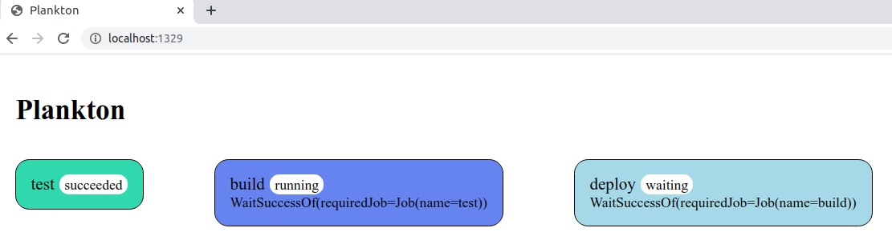

# Plankton

Plankton is a Container-Native CI/CD tool based on [The Compose Specification](https://github.com/compose-spec/compose-spec/blob/master/spec.md).

Labels can be used to define pipeline rules, such as job order, expressions to enable or disable jobs, among other rules.

## Example

Following this simple example, you can create a pipeline composed by 3 jobs/services:
`test`, `build` and `deploy`

Create a file called `plankton.compose.yaml` with the following content:

```yml
version: "3.7"

services:

  test:
    image: alpine
    command: echo Testing...

  build:
    image: alpine
    command: echo Building...
    labels:
      plankton.wait.success.of: test

  deploy:
    image: alpine
    command: echo Deploying...
    labels:
      plankton.wait.success.of: build
```

> The labels that start with `plankton.` rules the pipeline.
See the [Label Reference](#label-reference) section of this document.

Run the pipeline using the `docker run` command:

```shell
docker run -it --rm -v $PWD:/workspace -v /var/run/docker.sock:/var/run/docker.sock --network host adarlan/plankton
```

Then you can see the pipeline logs:


You can also view a graphical representation of the pipeline in your browser:
[http://localhost:1329](http://localhost:1329)



See more [examples](examples).

## Label Reference

| Label | Description |
| ----- | ----------- |
| `plankton.timeout` | Timeout for the service execution. |
| `plankton.enable.if` | Expression to enable the service. All services are enabled by default. |
| `plankton.wait.success.of` | A list of services that this service must wait for success. |
| `plankton.wait.failure.of` | A list of services that this service must wait for failure. |
| `plankton.wait.ports` | A list of published ports the service must wait for. |

## Argument Reference

| Argument | Description |
| -------- | ----------- |
| `--plankton.compose.file` | Defaults to `plankton.compose.yaml` |
| `--plankton.workspace` | Defaults to `.` |
| `--plankton.metadata` | Defaults to `.plankton` |
| `--plankton.docker.host` | Defaults to `unix:///var/run/docker.sock` |
