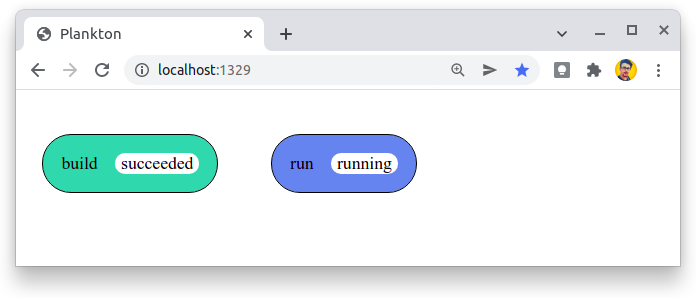
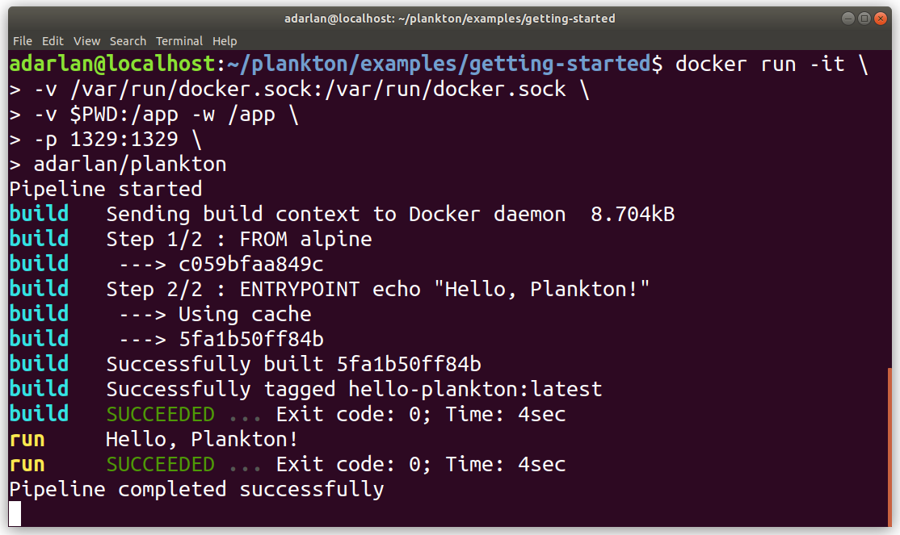
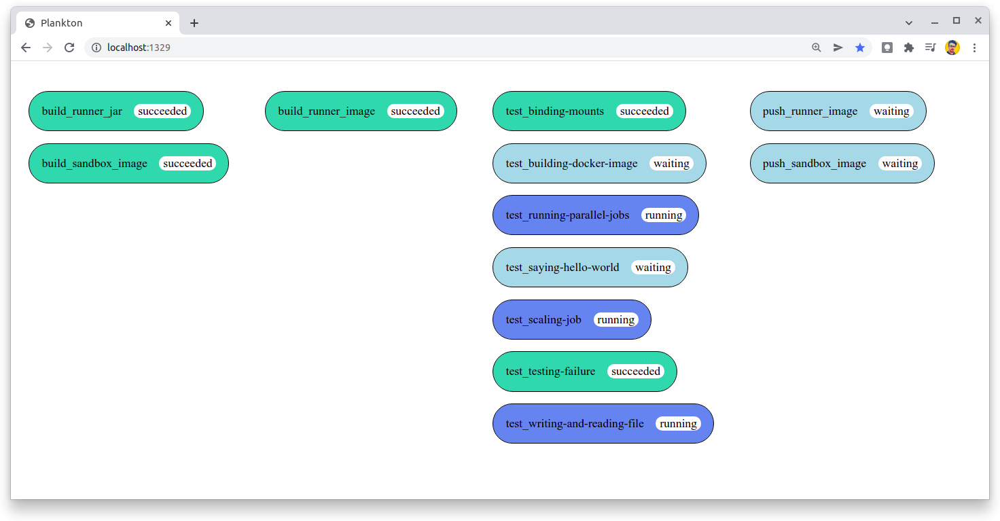

# Plankton


Plankton is a Container-Native CI/CD tool
based on the Compose Specification.

Just have a `plankton-compose.yaml` file containing the pipeline configuration
and execute a `docker run` command to start it.

## Compose Specification

The `plankton-compose.yaml` file is configured using the
[Compose Specification](https://github.com/compose-spec/compose-spec/blob/master/spec.md).

```yaml
services:
  job1: {}
  job2: {}
  job3: {}
```

Note that this is the same configuration format used by Docker Compose,
but it's not exclusive to Docker Compose.

The Compose Specification
establishes a standard for the definition of multi-container systems.
So instead of creating a unique configuration format for a tool,
we can use a well-defined specification
that is known to many people
and maintained by a global community.

## Container-Native

The Compose Specification is Container-Native.
That is, it allows the use of any container system that follows
the [Open Container Initiative](https://opencontainers.org/),
not only Docker containers.

At first, Plankton only supports Docker containers,
but the design patterns used in the code allow it to be extended by adding new adapters for other container systems.

## Run pipelines locally

Many CI/CD tools require you to push the source code to a remote repository
in order to run the pipeline on a server.

Plankton does not have yet a server
to listen for changes in code repositories
and start the pipelines automatically,
but it can be used to run pipelines locally,
just executing a `docker run` command.

Once the pipeline is running,
you can track its progress on the terminal or the web interface in your browser.

## Example

Create a `plankton-compose.yaml` file:

```yaml
services:

  list_cars:
    image: alpine
    entrypoint:
      - CARS="Saab Volvo BMW Fiat"
      - for car in $CARS; do echo $car; sleep 1; done

  list_fruits:
    depends_on: list_cars
    image: alpine
    entrypoint:
      - FRUITS="Banana Apple Mango"
      - for fruit in $FRUITS; do echo $fruit; sleep 1; done

  list_colors:
    depends_on: list_cars
    image: alpine
    entrypoint:
      - COLORS="Red Yellow Black Green Blue Brown White"
      - for color in $COLORS; do echo $color; sleep 1; done
```

Run the pipeline:

```shell
docker run -it \
  -v /var/run/docker.sock:/var/run/docker.sock \
  -v $PWD:/app -w /app \
  -p 1329:1329 \
  adarlan/plankton
```

Track the pipeline progress on the web interface at: [http://localhost:1329](http://localhost:1329)



Follow the pipeline logs on terminal:



[Here](https://github.com/adarlan/plankton/tree/master/examples)
you can find some other examples.

## Plankton uses itself

In the Plankton repository there is a `plankton-compose.yaml` file,
where is configured a pipeline to build, test and deploy Plankton itself.



To do this, run the pipeline by executing:

```shell
mvn spring-boot:run
```

## Contribute

Plankton is an open source CI/CD tool
with the potential to be more than a portfolio project
and become a real choice for CI/CD pipelines.

To contribute,
please share this project,
send a pull request
or give a feedback to [@adarlan on Twitter](https://twitter.com/adarlan).
