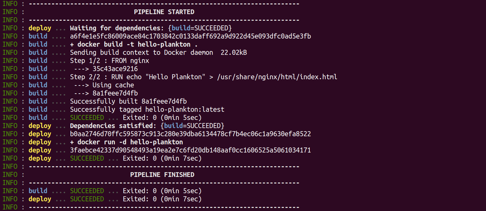
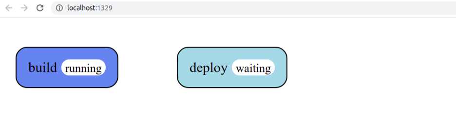
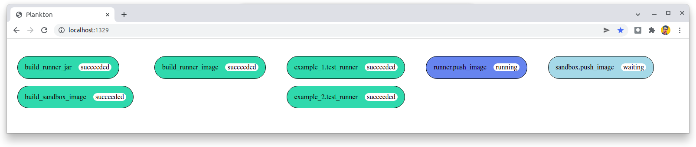

# Plankton

Plankton is a Container-Native CI/CD tool based on [The Compose Specification](https://github.com/compose-spec/compose-spec/blob/master/spec.md).

Just have a `plankton-compose.yaml` file containing the pipeline configuration
and execute a `docker run` command to start it.

## Compose Specification

The `plankton-compose.yaml` file is configured using the
[Compose Specification](https://github.com/compose-spec/compose-spec/blob/master/spec.md).

```yaml
services:
  test: { ... }
  build: { ... }
  deploy: { ... }
```

It's the same configuration format used by Docker Compose,
but it's not exclusive to Docker Compose.

The Compose Specification defines a standard configuration format for systems composed by containers.
So instead of creating a unique configuration format for a tool,
we can use a well-defined specification that is known to many people and maintained by a global community.

## Container-Native

The Compose Specification is defined as Container-Native.
That is, it allows the use of any container system that follows
the [Open Container Initiative](https://opencontainers.org/),
not only Docker containers.

At first, Plankton only supports Docker containers,
but the design patterns used in the code allow it to be extended by adding new adapters for other container systems.


## Run pipelines locally

Many CI/CD tools require you to push the source code to a remote repository
in order to run the pipeline on a server.

An interesting feature of Plankton is the possibility to run pipelines locally,
just executing a `docker run` command.

### Example

Follow the steps below to create a simple web application
and configure a pipeline to build and deploy it.
Then run the pipeline locally,
tracking its progress through terminal logs or the web interface in the browser.

> It requires Docker installed

#### Create a `Dockerfile`

```Dockerfile
FROM nginx
RUN echo "Hello, Plankton!" > /usr/share/nginx/html/index.html
```

This is the web application we are creating.
Just an Nginx web server
serving an index page that says "Hello, Plankton!".

#### Create a `plankton-compose.yaml` file

```yaml
services:
  build-app:
    image: docker
    volumes:
      - /var/run/docker.sock:/var/run/docker.sock
      - .:/app
    working_dir: /app
    entrypoint: docker build -t hello-plankton .

  deploy-app:
    depends_on: build-app
    image: docker
    volumes:
      - /var/run/docker.sock:/var/run/docker.sock
    entrypoint: docker run -d -p 8080:80 hello-plankton
```

This is the pipeline configuration.

`build-app` and `deploy-app` are the pipeline jobs.

> **Note**: The pipeline jobs are under the `services` key
> because the Compose Specification defines the components as "services".
> But, for CI/CD purposes, it would be better to call it "jobs".

The `build-app` job will build the application image.

The `deploy-app` job will run the application container.
Note that it depends on the success of the `build_app` job.

#### Run the pipeline

```shell
docker run -it -v /var/run/docker.sock:/var/run/docker.sock -v $PWD:/app -w /app -p 1329:1329 adarlan/plankton
```

- `-v /var/run/docker.sock:/var/run/docker.sock` is because Plankton needs access to the Docker host
- `-v $PWD:/app` and `-w /app` is because Plankton needs access to the directory containing the `plankton-compose.yaml` file
- `-p 1329:1329` is because Plankton provides a web interface, which you can open at `http://localhost:1329`

#### Follow the logs



#### Open the web interface at [http://localhost:1329](http://localhost:1329)



### More examples

[Here](https://github.com/adarlan/plankton/tree/master/examples)
you can find some other use cases of Plankton.

## Run pipelines on a sandbox

Plankton does not have yet a server
to listen for changes in code repositories
and start the pipelines automatically.

But thinking about it as a future implementation,
Plankton already provides a sandbox for each pipeline,
improving container isolation.
It's done using the [Sysbox Container Runtime](https://github.com/nestybox/sysbox).

The Plankton sandbox can be enabled by adding the `--sandbox` option.

Example:

```shell
docker run -it -v /var/run/docker.sock:/var/run/docker.sock -v $PWD:/app -w /app -p 1329:1329 adarlan/plankton --sandbox
```

> It requires Sysbox installed

## Plankton uses itself

In the Plankton repository there is a `plankton-compose.yaml` file,
where is configured a pipeline to build, test and deploy itself.



In this case, does not make sense to run the pipeline using the `docker run` command,
because it will always use the previous version of Plankton to test the current version.

Instead, run the pipeline executing:

```shell
mvn spring-boot:run
```

> It requires Maven and Docker installed

So it will run the current version of Plankton over itself.

To be able to push the Plankton images to the container registry,
you need to provide the registry credentials in the `plankton.env` file,
setting the following variables:

- `REGISTRY_USER`
- `REGISTRY_PASSWORD`
