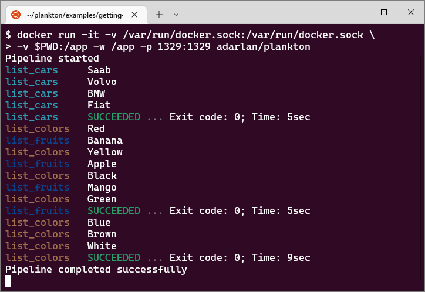

# Plankton


Plankton is an open source container-native CI/CD tool based on the Compose Specification.

All you need is a `plankton-compose.yaml` file containing the pipeline configuration.

This file is configured using the [Compose Specification](https://github.com/compose-spec/compose-spec/blob/master/spec.md).

```yaml
services:
  job1: {}
  job2: {}
  job3: {}
```

Note that this is the same configuration format used by Docker Compose, but it's not exclusive to Docker Compose.

The Compose Specification establishes a standard for the definition of multi-container systems.
So instead of creating a unique configuration format for a tool,
we can use a well-defined specification that is known to many people and maintained by a global community.

This is a container-native specification.
That is, it allows the use of any container system that follows
the [Open Container Initiative](https://opencontainers.org/),
not only Docker containers.

At first, Plankton only supports Docker containers,
but the design patterns used in the code allow it to be extended by adding new adapters for other container systems.

## Run pipelines locally

Many CI/CD tools require you to push the source code to a remote repository in order to run the pipeline on a server.

Plankton does not have yet a server to listen for changes in code repositories and start pipelines automatically,
but you can run pipelines locally just executing a `docker run` command.

Once the pipeline is running,
you can track its progress on the terminal or the web interface in your browser.

## Example

Create a `plankton-compose.yaml` file:

```yaml
services:

  list_cars:
    image: alpine
    entrypoint:
      - CARS="Saab Volvo BMW Fiat"
      - for car in $CARS; do echo $car; sleep 1; done

  list_fruits:
    depends_on: list_cars
    image: alpine
    entrypoint:
      - FRUITS="Banana Apple Mango"
      - for fruit in $FRUITS; do echo $fruit; sleep 1; done

  list_colors:
    depends_on: list_cars
    image: alpine
    entrypoint:
      - COLORS="Red Yellow Black Green Blue Brown White"
      - for color in $COLORS; do echo $color; sleep 1; done
```

Run the pipeline:

```shell
docker run -it \
  -v /var/run/docker.sock:/var/run/docker.sock \
  -v $PWD:/app -w /app \
  -p 1329:1329 \
  adarlan/plankton
```

Track the progress on your browser: [http://localhost:1329](http://localhost:1329)


Follow the logs on terminal:



## Learn more

- [Using Plankton to test, build and deploy itself](docs/building-itself.md)
- [Try Plankton in Play-with-Docker](docs/running-in-pwd.md)
- [Running Plankton jobs in a sandbox](docs/sandbox.md)
- [Plankton CLI reference](docs/runner-configuration.md)
- [Plankton pipeline configurarion reference](docs/pipeline-configuration.md)
- [Using Plankton to build and smoke-test a web application](examples/testing-web-application/)
- [Running parallel jobs with Plankton](examples/running-parallel-jobs/)
