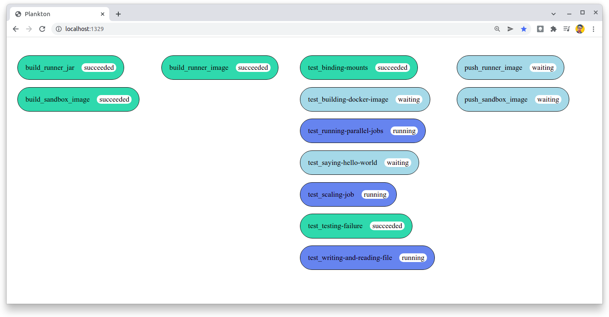

## Plankton uses itself

In the Plankton repository there is a `plankton-compose.yaml` file,
where is configured a pipeline to build, test and deploy the Plankton itself.



In this case, does not make sense to run the pipeline using the `docker run` command,
because it will always use the previous version of Plankton to test the current version.

Instead, run the pipeline executing:

```shell
mvn spring-boot:run
```

> It requires Maven and Docker installed.

So it will run the current version of Plankton over itself.

To be able to push the Plankton images to the container registry,
you need to provide the registry credentials in the `plankton.env` file,
setting the following variables:

- `REGISTRY_USER`
- `REGISTRY_PASSWORD`
